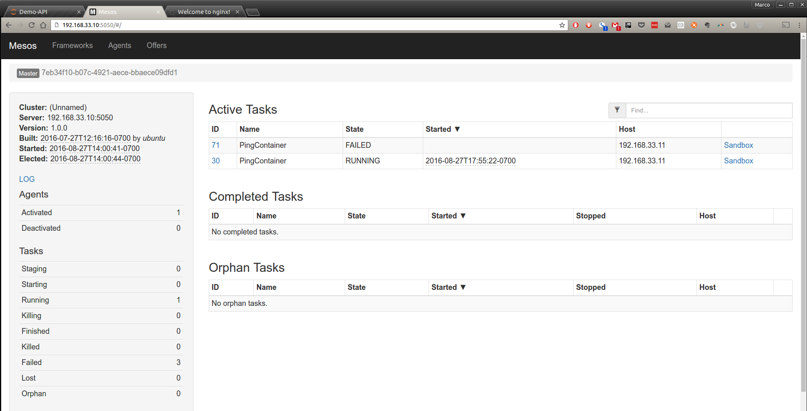
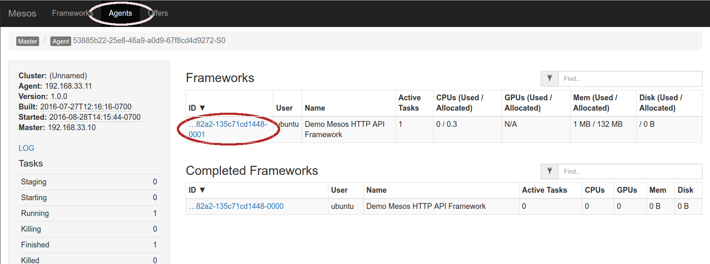
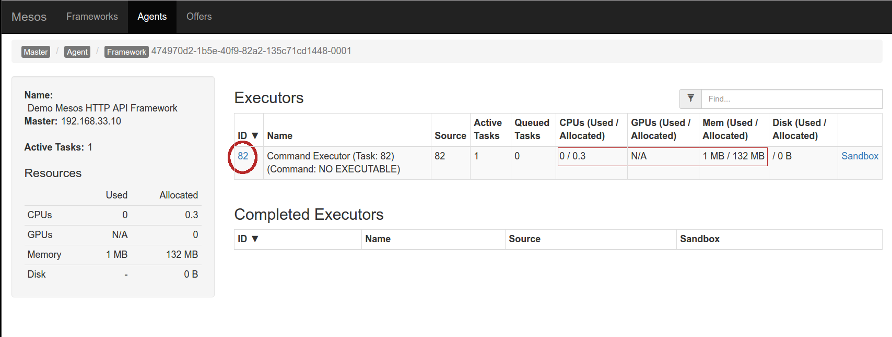
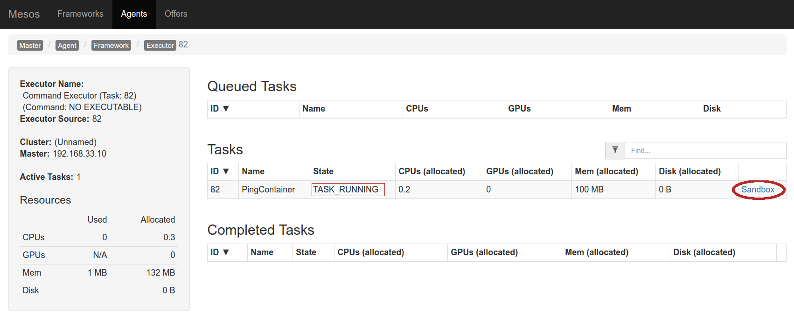
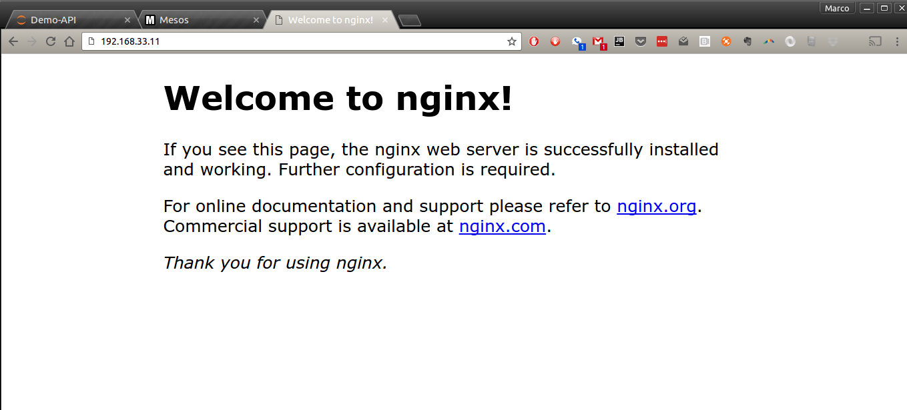
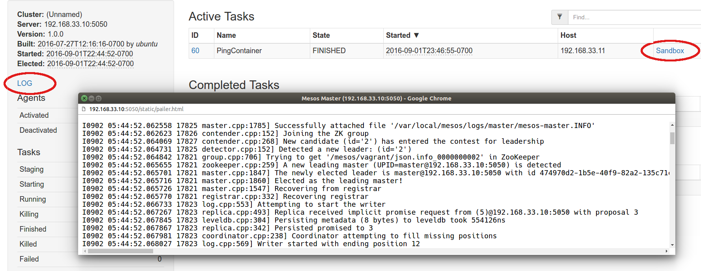

# Exploring the HTTP API for Fun and Profit

> This document has been published as a three-part blog series on the [CodeTrip blog](https://codetrips.com/2016/08/27/a-python-notebook-to-experiment-with-the-apache-mesos-http-api-part-1-of-3/) in September, 2016.
>
>In turn, this document is an extended (and updated) version of the [talk] I gave at **MesosCon Europe 2015** updated for Apache Mesos 1.0.0, which was released in August 2016: you can also find the [slides here]._

## Introduction

This document describes in a certain detail the working of the `notebooks/Demo-API` Python notebook: it is pretty jam-packed and requires a certain amount of familiarity with some concepts around containers, VMs and Mesos, but I am taking the time to show all the intermediate steps (hence, the 3-parts) and it should be easy to follow even if you have never used before Vagrant, Mesos or jupyter notebooks, for that matter.

A certain degree of familiarity with Python, requests and handling HTTP responses is going to be certainly helpful, as we will not be going into too much details there.

See also see the [README](https://github.com/massenz/zk-mesos) for more details about building and developing with `zk-mesos`.


## Getting Started

In order to follow along, you will need to clone the repository (as shown above) and install [Virtualbox](http://virtualbox.org) and [Vagrant]: they are both super-easy to get going, please follow the instructions on their respective sites and you'll be up and running (literally) in no time.

I also recommend to quickly scan the [Vagrant documentation]: a knowledge of Vagrant beyond  `vagrant up` is not really required to get the most out of this series, but it may help if you get stuck (or would like to experiment and improve on our `Vagrantfile`).

If you are not familiar with [Apache Mesos](https://mesos.apache.org) I would recommend to have a look at the project's site: there are also a couple of good books out there, [Mesos in Action] being the one I would recommend (also having been one of the manuscript's reviewers).

We will __not__ be building it from source here, but will instead use [Mesosphere packages]: you don't need to download them, the `Vagrantfile` will automatically download and install on the VMs.

To run the Python notebook, we will take advantage of the [Jupyter](http://jupyter.org) packages, and use a `virtualenv` to run all our code: the latter is not strictly necessary, but will prevent you messing up your system Python.

The steps are pretty simple, and YMMV, but if you have never used [virtualenv](https://virtualenv.pypa.io/en/stable/installation/) before:

    $ sudo pip install virtualenv

and then create and run a virtualenv:

    $ cd zk-mesos
    $ virtualenv mesos-demo
    $ source mesos-demo/bin/activate
    $ pip install -r requirements.txt

Finally, verify that you can run and load the Jupyter notebook:

    $ jupyter notebook

this should automatically open your browser and point it to http://localhost:8888, from where you can select the `notebooks/Demo-API.ipynb` -- don't run it just yet, but if it shows up, it will confirm that your Python setup is just fine.

## Building and installing Apache Mesos

Here is where the beauty of Vagrant shows in all its glory: installing Apache Messos Master and Agent is not trivial, but in our case, it's simply a matter or:

    $ cd vagrant
    $ vagrant up

(make sure to be in the same directory as the `Vagrantfile` when issuing any of the Vagrant commands, or it will complain about it).

It is worth noting that we are building __two__ Vagrant boxes, so any command will operate on __both__ unless specified; to avoid this, you can specify the name of the VM after the command; for example, to SSH onto the Agent:

    $ vagrant ssh Agent

should log you in on that box, from where you can explore, experiment and diagnose any issues.

The `vagrant up` command will take some time to execute, but it should eventually lead your Virtualbox to have two VMs, named respectively `mesos-master` and `mesos-agent` - incidentally, you should never need to use VBox to manage them (all the tasks can be undertaken via Vagrant commands), but you can do that too, if necessary or desired.

Once the VMs are built, ensure you can access Mesos HTTP UI at: <http://192.168.33.10:5050>;
you should also see one agent running, accessible either via the Master UI, or directly at: <http://192.168.33.11:5051/state>.

__NOTE__
> the Agent runs at a different IP (obviously) than the Master, but also on a different __port__ (__5051__ instead of __5050__): look into `vagrant/run-agent.sh` to see a few of the command line flags that we use to run the Agent (and in `run-master.sh` for the Master).

### Zookeeper

It's worth noting that we are also running an instance of Zookeeper (for Leader election and Master/Agent coordination) on the `mesos-master` VM, inside a Docker container: partly because we can, but also to show how easy it is to do so using containers.

This one line (in `run-master.sh`), will give you a perfectly good ZK instance (albeit, a catastrophically unreliable one in a production environment, where you want to run at least 3-5 nodes, at least, an on physically separate machines/racks):

    docker run -d --name zookeeper -p 2181:2181 -p 2888:2888 -p 3888:3888 jplock/zookeeper:3.4.8

To diagnose issues around Zookeeper, you could run the client inside the running container:

_SSH into the master VM_

    vagrant ssh master

_check that zookeeper is running_

    ubuntu@mesos-master$ sudo docker ps
    CONTAINER ID        ...         CREATED             STATUS     PORTS            NAMES
    6c99a6db2d2a        ...         8 days ago          Up 8 days  2181->2181/tcp   zookeeper

if it's not running, you will need to remove it and re-run it:

    ubuntu@mesos-master$ sudo docker rm $(sudo docker ps -qa)
    ubuntu@mesos-master$ sudo docker run -d --name zookeeper -p 2181:2181 -p 2888:2888 \
                            -p 3888:3888 jplock/zookeeper:3.4.8

_run the shell client (zkCli.sh)_

    ubuntu@mesos-master$ sudo docker exec -it zookeeper /opt/zookeeper/bin/zkCli.sh

and verify that we have a running elected leader:

    # This shows no leader is running:
    [zk: localhost:2181(CONNECTED) 1] ls /mesos/vagrant
    [log_replicas]

    # This shows there is a leader elected, and that, on this VM, there have been at least
    # 3 Mesos Masters that have come and gone...
    [zk: localhost:2181(CONNECTED) 0] ls /mesos/vagrant
    [json.info_0000000004, log_replicas]

    [zk: localhost:2181(CONNECTED) 1] get /mesos/vagrant/json.info_0000000004
    {"address":{"hostname":"mesos-master","ip":"192.168.33.10","port":5050},"hostname":"mesos-master","id":"a6b81918-6291-47be-a821-bf19bdace8f9","ip":169978048,"pid":"master@192.168.33.10:5050","port":5050,"version":"1.0.0"}
    # ... followed by a number of statistics about the node itself


## Python Notebook primer

A "notebook" is a mixture of Markdown and code which can be executed inside a Python kernel, the output of the command's execution is shown below the "cell" - which is essentially a region of contiguous text.

The code itself (or the Markdown, for that matter) can be edited directly (double-click on it, or hit Enter) by simply pressing Shift-Enter (or Alt-Enter, to create an empty cell below the current one).


A full tutorial on Python's notebooks is vastly beyond the scope of this paper, suffice to say that you can:

- Follow along by hitting Shift-Enter to execute the cell's code and move to the next; and
- Modify and re-execute the code to experiment further with the concepts shown here.

Only one caveat: because the code assumes (and, indeed Mesos HTTP API requires) an ongoing background thread and some amount of shared data, some parts of the code may be "unsafe" to run multiple times; but no fear: if you get stuck, just "Stop and Restart" the kernel (sometimes simply closing and re-opening the notebook may not be sufficient).

In the following, I will simply reproduce brief snippets of the notebook and provide some clarification comments: for the actual output, the full code and the comments there, please see the actual notebook.

## Mesos HTTP API

As described in [Mesos documentation](http://mesos.apache.org/documentation/latest/scheduler-http-api/), the API does not follow REST principles, relying instead on a "callback" mechanism that closely resembles the original `libmesos` Scheduler API.

This means, in practice, that any client ("framework" in Mesos parlance) will need to maintain __two concurrent__ connections:

- one "permanent," streaming data back to the framework; and
- one "ephemeral," executing multiple requests from the framework to Master, and carrying the former's commands (e.g., Accept Offer).

The asynchronous results from the ephemeral requests (beyond the immediate, synchronous validation of the request itself) is carried back via the permanent channel.

Please read the docs (or consult the [Mesos in Action] book) for more details.

In our notebook, we open (and keep streaming) the connection using the `post` method defined in the cell that is entitled _"POST helper method"_ :

```python
def post(url, body, sid=None, **kwargs):
    """ POST `body` to the given `url`.

        @return: the Response from the server.
        @rtype: requests.Response
    """
```

when we pass a `stream` argument (with whatever value), it will assume that that one is the "permanent" connection, and will keep it open, streaming back the Master's responses and extracting the values, depending on the type of the response:

```python
if body.get("type") == "ERROR":
    print("[ERROR] {}".format(body))
    global last_error
    last_error = body
# etc ...
```
__please don't do this at home__ see [my other post](https://medium.freecodecamp.com/make-your-code-more-pythonic-using-pythons-special-methods-b348f915852e#.wb29ym44z) as to why a "castle of ifs" is a Truly Bad Thing and a _much better way of handling this_.

## API Requests / Responses format

As you can see, the format of both requests and responses is JSON, however, Mesos will also "understand" serialized Protocol Buffers: in fact, the format of the JSON requests looks a bit awkward because it is actually generated automatically from the Proto format (all of the API messages can be seen in the [Mesos code repository](https://github.com/apache/mesos/blob/master/include/mesos/v1/scheduler/scheduler.proto)).

So, for example, to subscribe our framework to Master, we send a `SUBSCRIBE` message:

```python
SUBSCRIBE_BODY = {
    "type": "SUBSCRIBE",
    "subscribe": {
        "framework_info": {
            "user" :  "ubuntu",
            "name" :  "Demo Mesos HTTP API Framework"
        },
        "force" : True
    }
}
```

and we expect back a `SUBSCRIBED` response, that will carry back a `Stream ID` - to see this in action, run the cell (and all of the above ones first) entitled _Registering a Framework_:

```python
try:
    kwargs = {'stream':True, 'timeout':30}
    persistent_channel = Thread(target=post, args=(API_URL, SUBSCRIBE_BODY), kwargs=kwargs)
    persistent_channel.daemon = True
    persistent_channel.start()
    print("The background channel was started to {}".format(API_URL))
except Exception as ex:
    print("An error occurred: {}".format(ex))
```
----
    Connecting to Master: http://192.168.33.10:5050/api/v1/scheduler
    body type:  SUBSCRIBE
    The background channel was started to http://192.168.33.10:5050/api/v1/scheduler
    Stream-id:  31e0c731-f055-4588-b0f0-5cdfaed5260c
    Framework 474970d2-1b5e-40f9-82a2-135c71cd1448-0000 registered with Master at (http://192.168.33.10:5050/api/v1/scheduler)

As you can see the snippet above starts a background thread, and executes the `post` method, sending a `SUBSCRIBE_BODY` message: what we got back from Mesos is:

- a Framework ID (which uniquely identifies our "framework"); and
- a Stream-id, which we will need to store and reuse in every subsequent request.

```python
    # See in the post() method
    if body.get("type") == "SUBSCRIBED":
        global framework_id, stream_id, headers
        stream_id = r.headers['Mesos-Stream-Id']
        headers['Mesos-Stream-Id'] = stream_id
```

We extract from the response (`r`) headers the `Stream-id` and we insert it into the `headers` that will be reused in every subsequent request.

## Consuming Data Center resources

This is all very exciting and much fun, but it wouldn't be much use to anyone if it didn't give us the means to do what Mesos was meant to do: namely, provide orderly access to distributed computing resources (more specifcally, computing (CPU), storage (disk) and networking (ports, essentially)).

A complete discussion of Mesos resources management and its allocation strategy (currently based on [Dominant Resource Fairness], or DRF) is certainly outside the scope of this series, but suffice to say that Mesos aims at providing fair access to a set of shared resources by ensuring that each framework is only offered a "fair fraction" of the available total.

Setting various flags (around _roles_ and _weights_) it is possible to fine-tune the allocation of certain resources across frameworks, and keeping them isolated (via [Linux cgroups]) thus allowing low priority workloads (e.g., development or testing applications) to run alongside high-priority (e.g., production) ones - in turn, this allows for denser packing of runtime binaries and a more efficient utilization of computing resources (not to mention, greatly simplifying the operation and management of the DC resources).

The first step in launching a "task" (in Mesos parlance, this can be a binary runtime or a container) is to accept an Offer from one of the Agents: here, we only have one, so not much to choose from, but in a real production environment, we could be more selective on which one we'd be prepared to accept offers from: this would entail using the Agent's _attributes_.

Just for the fun of, I have set our Agent to have the following attributes (see the `run-agent.sh` script):

```
--attributes="rack:r2d2;pod:demo,dev" \
```
which you can also see when hitting the _/state_ endpoint:


As we will shortly see, these are in the Offer response too, so we could use that to filter out those agents which we don't quite like or trust.

Run the _Wait for Offers_ frame, and you should see a response that looks something like (the following is __much__ simplified):
```
{"offers": [
   {...
    "attributes": [ {
            "name": "rack",
            "text": {
                "value": "r2d2"
            },
            "type": "TEXT"
        },
        {
            "name": "pod",
            "text": {
                "value": "demo,dev"
            },
            "type": "TEXT"
        }
    ],
    ...
    "resources": [
        {
            "name": "ports",
            "ranges": {
                "range": [ {"begin": 9000, "end": 10000}]
        },
        {
            "name": "cpus",
            "role": "*",
            "scalar": {"value": 2.0},
        },
        {
            "name": "mem",
            "role": "*",
            "scalar": {"value": 496.0},
        },
        {
            "name": "disk",
            "role": "*",
            "scalar": { "value": 4930.0 },
        }
    ],
    ...
] }
```
You can see there both the `attributes` as well the resources that are available from the Agent (the VM that we started, with 2 cores, and approximately 500MB RAM and 5GB hard disk); the `role: *` means essentially that those resources are __not__ reserved for any specific role (e.g., "Prod" or "Marketing" or whatever) and can be allocate to any framework that requests them.

Note that, whilst the title says "waiting for offers" in reality, those were already there waiting for us: shortly after registering, Master would have selected (using DRF) the most appropriate set of offers (made available from the Agents connected to it) and sent to us via the "streaming" channel.

Be that as it may, we gladly accept them and, in the next and last part of this series, we will use them to run an Ngnix container and serve static pages from our Agent VM.


## Accepting Offers

Although recently Mesos has evolved its model to allow frameworks to pre-emptively reserve resources and sort of stash them aside for peak demands (or launching high-priority workloads), as well as for "best-effort" allocation of unused resources to low-priority tasks, which wouldn't mind being booted out of those reserved resources are claimed by their rightful owners, we will not address those use cases here.

For those interested, I would recommend reading [Reservation](http://mesos.apache.org/documentation/latest/reservation/) and [Oversubscription](http://mesos.apache.org/documentation/latest/oversubscription/) documents, as well as follow the development activity on the Mesos mailing lists: both features have been introduced only recently and are likely to continue evolve in the feature.

Obviously, if there is enough interest in such topics, we could be convinced to write a dedicated series on the topic...

To "accept" offers, all we need to do is to tell Master what we would like to do with them (namely, run an Ngnix container) and how much of what's been offered we'd like to take (in a shared, high load environment such as a Production Data Center, it is usually good manners only to use as little, or as much, as actually needed, and rely on the "elasticity" of the underlying resources, to deal with sudden increases in load).

The file `resources/container.json` has the full body of the request (of type `ACCEPT`) that we will send to Master; as you can see, several fields are marked as `null`, because they contain dynamically generated values that we need to fill in so that Master can reconcile our request with how many offers, frameworks and tasks it has pending - in a realistic production environment, a Mesos Master could be handling upwards of hundreds of frameworks, thousand of Agents and many tens of thousand tasks (even though, actually the tasks are managed by the Agents themselves).

```python
container_launch_info = get_json(DOCKER_JSON)

# Need to update the fields that reflect the offer ID / agent ID and a random, unique task ID:
task_id = str(random.randint(1, 100))
agent_id = offers.get('offers')[0]['agent_id']['value']
offer_id = offers.get('offers')[0]['id']

container_launch_info["framework_id"]["value"] = framework_id
container_launch_info["accept"]["offer_ids"].append(offer_id)

task_infos = container_launch_info["accept"]["operations"][0]["launch"]["task_infos"][0]
task_infos["agent_id"]["value"] = agent_id
task_infos["task_id"]["value"] = task_id
task_infos["resources"].append(get_json(TASK_RESOURCES_JSON))
```

The code above does the following:

- load the `DOCKER_JSON` file and build a `dict` out of it;
- extract the `agent_id` and `offer_id` from the `OFFERS` response we received on the "streaming" channel (see the `post()` method, as well as the full breakdown of the response in the notebook output - this was described in [Part 2](https://codetrips.com/2016/09/02/a-python-notebook-to-experiment-with-the-apache-mesos-http-api-part-2-of-3/)) and put them back in our request: this will enable Master to reconcile the two: failing to do so, will cause Master to refuse the request;
- finally, take a reference to the `task_info` field of the request, and then update its fields to contain the `agent_id` and `task_id` (this is just a convenience to avoid some typing and a __very__ long statement).

### Task ID

You may have noticed this strange line in the snippet above:

    task_id = str(random.randint(1, 100))

The `TaskID` is used by the Agent to uniquely identify the tasks from a framework and it's also meant for the users ("operators") to be able to track tasks that are launched on Mesos: it can be really anything (Mesos doesn't care, so long as it's unique per framework) and you will see its use in a second.

I have chosen to use a random integer between 1 and 100, but __note Mesos expects a field of type string__, so we convert it via the `str()` method.

## Launching a container

With all the above done, it's time to fire it off:

        r = post(API_URL, container_launch_info)

which is a bit of an anti-climax, but will result (unless you've messed around with the JSON format and made it fail some syntax check or the conversion to Protocol Buffer, the format used internally by Mesos) in a

    Connecting to Master: http://192.168.33.10:5050/api/v1/scheduler
    body type:  ACCEPT
    Result: 202

Note that you will get a `202` __regardless of whether the task was successfully launched, or failed post launch, or anything else, for that matter, that could have happened to it__.

As mentioned in the previous post, the API model is an asynchronous one and you will get the actual outcome of your request (beyond a simple syntactic validation) over the "streaming" channel (the equivalent of the _callback methods_ of the original C++ Scheduler API).

In a "real life" Framework, after sending a request to launch a task, we would wait for an "event" posted back by the Master and specifically wait for an `UPDATE` or a new `OFFER` message to discover whether the task was successfully launched or had failed.

See the [Scheduler API](http://mesos.apache.org/documentation/latest/scheduler-http-api/) for more details and a full list of messages and events.

For our part, we will explore the success (or otherwise) of our launch by using the Master UI:

    http://192.168.33.10:5050

should show a list of Active/Completed/Orphan tasks and, with any luck, a new one should be listed in the `Active` pane, with `TASK_RUNNING` status:



Alternatively, you can click on the `Agents` button on the tab bar at the top and then follow the link to the one running agent, to see a list of `Frameworks` whose tasks are running on the Agent:



and clicking on the active one (you can see I've been experimenting...) take you to a list of "Executors"(1)



where you can see the task just launched (notice the `ID` - this is where we would see whatever we were to set for the `task_id`: in our case just an integer under 100):



and, finally, we could hit the `Sandbox` link to look at the STDOUT/STDERR from the task execution.

Notice how we only requested a tiny fraction of what we were offered: just 20% CPU and 100MB of RAM - and, in fact, using even less.

The requested resources were defined in the `"resources"` field:

    task_infos["resources"].append(get_json(TASK_RESOURCES_JSON))

and are defined in the `resources/task_resources.json` file:

```json
[
    {
        "name": "cpus",
        "role": "*",
        "scalar": {"value": 0.2},
        "type": "SCALAR"
    },
    {
        "name": "mem",
        "role": "*",
        "scalar": {"value": 100},
        "type": "SCALAR"
    }
]
```

If all looks well and the task is in the `TASK_RUNNING` state (if not, there is a "Troubleshooting" section at the end), you should be now able to access the just-launched Nginx server on it default HTTP (80) port:

    http://192.168.33.11

Notice how this is the Agent's IP address __not the Master__: the container is running on the Agent and using its resources:



Obviously, this just shows the default page: in a real live situation, we would use two possible alternative approaches:

- build our own container image, with the desired static pages (and whatever other custom Ngnix configuration made sense) and possibly even with some proxying logic to a dynamic online app;

- download and extract a tarball with the website's static contents (not just HTML/CSS but Javascript too, possibly), as described below.

## Downloading content to Mesos Agents

One of the fields of the `Accept` [Protocol Buffer](https://github.com/apache/mesos/blob/master/include/mesos/v1/scheduler/scheduler.proto#L242) is an [Offer.Operation](https://github.com/apache/mesos/blob/master/include/mesos/v1/mesos.proto#L1272) which in turn can be of several "types", one of which (`LAUNCH`) implies that its content are a 'Launch' message, in turn containing an array (or `list<TaskInfo>` if you are into C++) of [TaskInfo](https://github.com/apache/mesos/blob/master/include/mesos/v1/mesos.proto#L1272) dictionaries: if you are not confused yet, you've not been following closely...

The bottom line is, at any rate, that the content of the `task_info` could contain a [CommandInfo](https://github.com/apache/mesos/blob/master/include/mesos/v1/mesos.proto#L462) field, called `"command"`:

```json
...,
"command": {
  "uris": [
    {
      "value": "http://192.168.33.1:9000/content.tar.gz",
      "extract": true
    }
  ],
  "shell": true,
  "value": "cd /var/local/sandbox && python -m SimpleHTTPServer 9090"
},
...
```
The list of URIs can contain any URL that is reachable by the Agent, and whose contents will be fetched and, optionally (if `extract` is `true`) uncompressed into the container "sandbox": the field we have specified at launch with (see the `run_agent.sh` script):

    --sandbox_directory=/var/local/sandbox

This finally closes this, admittedly convoluted, detour: if we were to configure our Ngnix server (or whatever other application we were to launch)  to use that directory as the source for the site pages, those would be served instead.

An example of how to do this using a much simpler Python `SimpleHTTPServer` is demonstrated alongside the alternative method of executing a command on the Agent (as opposed to launching a container - the dynamic of downloading a remote file remains the same) in the notebook's section called __"Launch a Task using the given offers"__.

This will need you to setup somehow a server to serve the `content.tar.gz` file on your local dev box (or wherever you feel like) and changing the JSON in the request to use `resources/container.old.json` in the repository, which is maybe a good "exercise for the reader," but maybe one step too far for some.

A couple of considerations:

- a recently implemented feature allows Mesos to cache content downloaded dynamically (including container images): for more information, please see the [Fetcher Cache](http://mesos.apache.org/documentation/latest/fetcher/) excellent document;

- directly launching a binary on an Agent (as opposed to downloading and running a container image) runs counter, in my view, to the whole spirit of treating your machines "as a herd, not a pet" in a modern, DevOps-oriented production environment: this requires to choose between to equally bad options:

    - use some form of packaging and configuration management (e.g., Chef or Puppet) to ensure all your Agents have the same set of binaries and will be able to run them upon request; or

    - use a (possibly, cumbersome) combination of roles and attributes (see Part 2) to ensure frameworks are only able (or allowed) to launch certain binaries on certain agents.

Compared with the simplicity of having a cluster (possibly, running in the 000's of machines, all identically provisioned) and letting Mesos just pick one for you and then download and run a container (again, possibly, from a private image registry, managed via a CI/CD infrastructure), it seems to me a much more scalable, agile and definitely less error-prone approach.

But, there you have it: in case you wish to run a binary, the code for how to do it is shown there.

## Troubleshooting

If your Master server dies, or you can't launch the container, there are a few steps that I've found useful when creating the code and this blog entry:

### 1. restart the Master:

    cd vagrant
    vagrant ssh master
    ps aux | grep mesos | grep -v grep
    # Is there anything running here? if not:
    sudo ./run-master.sh
    # you can happily ignore Docker whining about ZK already running (also see below)

### 2. is Zookeeper still alive?

    cd vagrant
    vagrant ssh master
    sudo docker ps
    # is the zk container running? if not, you can restart it:
    sudo docker rm $(sudo docker ps -qa)
    sudo docker run -d --name zookeeper -p 2181:2181 \
        -p 2888:2888 -p 3888:3888 jplock/zookeeper:3.4.8
    # Alternatively, as ZK going away means that usually Master terminates too, use
    # the solution above to restart Master.

### 3. Is the Agent active and running?

Start from `http://192.168.33.11:5051/state` - if nothing shows, then follow a similar solution as to the above to restart the agent:

    cd vagrant
    vagrant ssh agent
    ps aux | grep mesos | grep -v grep
    # Is there anything running here? if not:
    sudo ./run-agent.sh

Head back to your browser and check whether the UI is responsive again.
If the server is running but unresponsive, or seems to be unable to connect to the Agent or whatever, you can just kill it:

    ubuntu@mesos-master:~$ ps aux | grep mesos | grep -v grep
    root     18630  0.0  4.3 1318424 43728 pts/1   Sl   20:29   0:02 mesos-master
    ubuntu@mesos-master:~$ sudo kill 18630

(and resort to a `-9`, `SIGKILL` if it really has become completely unresponsive).

### 4. Keep an eye on the logs

As mentioned also in Part 2, it is always useful to keep a browser window open on the Master and Agent logs - this can be done via the `LOG` link in their respective UI pages:



They usually provide a good insight into what's going on (and what went wrong); alternatively, you can always `less` them in a shell (via the `vagrant ssh` shown above): the log directories are set in the launch shell scripts:

    # In run-master.sh:
    LOG_DIR=/var/local/mesos/logs/master

    # In run-agent.sh
    LOG_DIR=/var/local/mesos/logs/agent

and you will something like this (I usually find the `INFO` logs the most useful, YMMV):

    ubuntu@mesos-master:~$ ls /var/local/mesos/logs/master/
    mesos-master.ERROR
    mesos-master.INFO
    mesos-master.mesos-master.root.log.ERROR.20160828-211508.2991
    mesos-master.mesos-master.root.log.ERROR.20160902-080919.17820
    mesos-master.mesos-master.root.log.INFO.20160827-210041.30302
    mesos-master.mesos-master.root.log.INFO.20160828-210703.2991
    mesos-master.mesos-master.root.log.INFO.20160902-054452.17820
    mesos-master.mesos-master.root.log.INFO.20160903-202955.18630
    mesos-master.mesos-master.root.log.WARNING.20160827-210041.30302
    mesos-master.mesos-master.root.log.WARNING.20160828-210703.2991
    mesos-master.mesos-master.root.log.WARNING.20160902-054452.17820
    mesos-master.mesos-master.root.log.WARNING.20160903-202955.18630
    mesos-master.WARNING

Note that the `mesos-master.{ERROR,INFO,WARNING}` are just symlinks to the files being currently appended to by the running processes.

### 5. Dammit, all else failed!

Ok, time to bring the heavy artillery out: destroy the boxes and rebuild them from scratch:

    cd vagrant
    vagrant destroy
    vagrant up

this is nasty and time-consuming, but it guarantees a clean slate and should set you back into a working environment.

## Conclusion

This has been a long ride: between updating the Python notebook, creating and fine-tuning the Vagrant boxes and drafting these blog entries, it has taken me almost a month and many hours of experimenting with Mesos and its HTTP API.

It has been overall a fun experience and I believe it has helped me learn more about it; it also provides a good foundation upon which to build a Python library to abstract much of the low-level complexity: I will continue to work and update the [zk-mesos](https://github.com/massenz/zk-mesos) repository; please come back from time to time to check on progress or, even better, feel free to fork and contribute back your code via pull requests.

Just remember, [no smelly code](https://codetrips.com/2015/01/25/do-not-allow-bad-smells-in-your-code/)!


[Mesosphere packages]: http://open.mesosphere.com/downloads/mesos/
[Vagrant]: https://www.vagrantup.com
[Vagrant documentation]: https://www.vagrantup.com/docs
[Virtualbox]: https://www.virtualbox.org/wiki/Documentation
[Zookeeper documentation]: https://zookeeper.apache.org/doc/trunk/
[talk]: https://youtu.be/G7xfEs0lX5U
[slides]: http://events.linuxfoundation.org/sites/events/files/slides/MesosCon%20EU%20-%20HTTP%20API%20Framework.pdf
[Mesos in Action]: http://amzn.to/2citsRx
[Dominant Resource Fairness]: https://people.eecs.berkeley.edu/~alig/papers/drf.pdf
[Linux cgroups]: https://en.wikipedia.org/wiki/Cgroups
