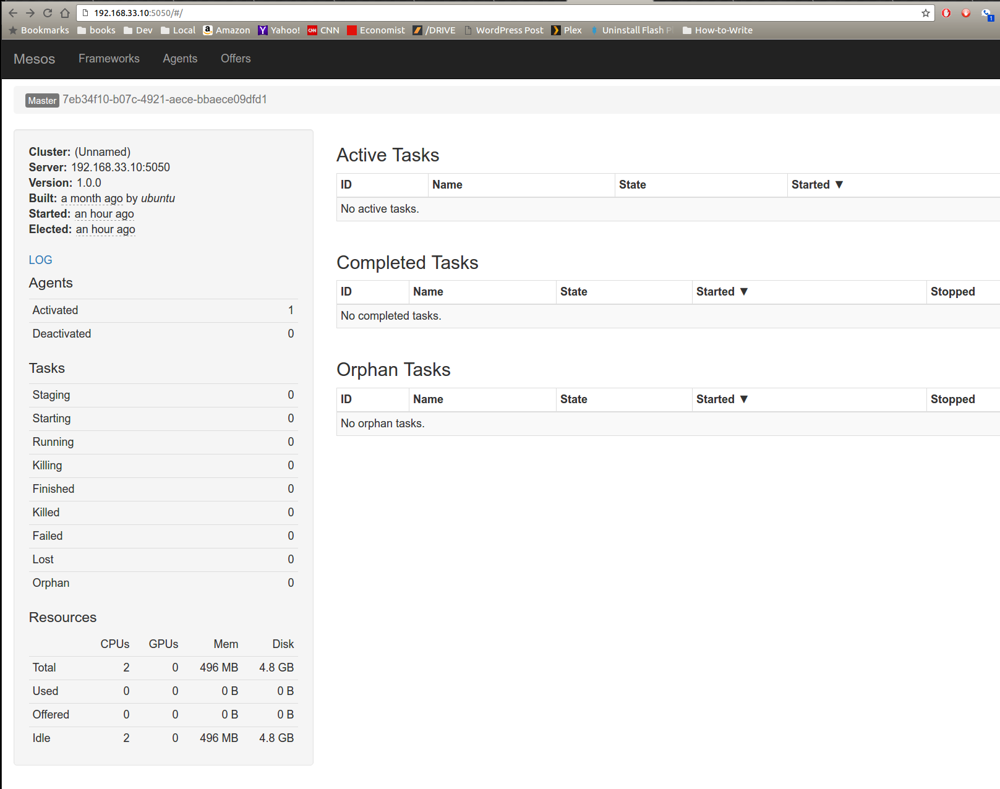
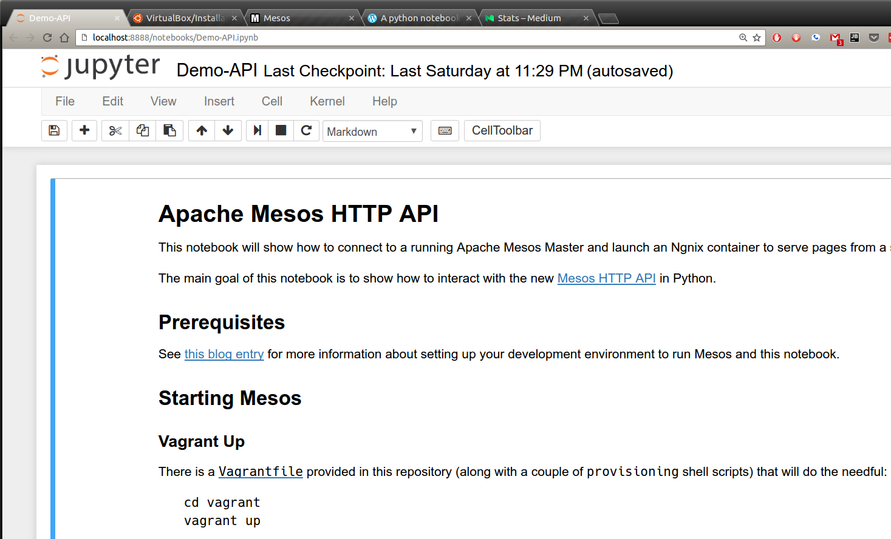
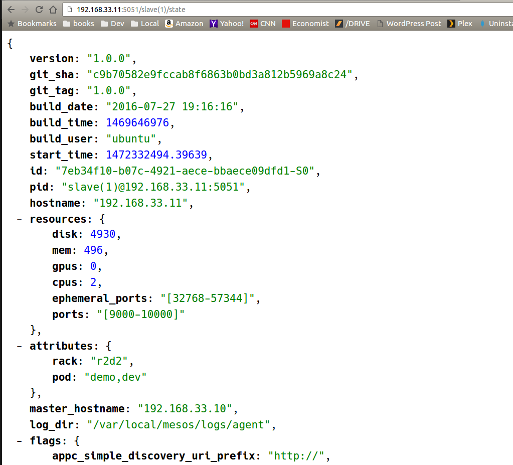

# A python notebook to experiment with the Apache Mesos HTTP API - Part 2 of 3

_This is the second part of a three-part series: [Part 1](https://codetrips.com/2016/08/27/a-python-notebook-to-experiment-with-the-apache-mesos-http-api-part-1-of-3/) describes the required setup and how to get Apache Mesos Master and Agent running in two Vagrant VMs_

_This series is an extended (and updated) version of the [talk] I gave at **MesosCon Europe 2015** updated for Apache Mesos 1.0.0, which has just been released (August 2016) - you can also find the [slides] there._

## Recap

So, by the end of the first part, you should have two running VMs, to which you can connect; the following assumes that you can successfully point your browser to:

    http://192.168.33.10:5050

and see this page:



Further, you have an active `virtualenv` environment (I called it `demo`, feel free to give whichever name you feel like) and you can run Jupyter notebooks with it: in other words, running this from a terminal:

    source ./demo/bin/activate
    jupyter notebook

will show the Jupyter home page, from which you can load the `notebooks/Demo-API.ipynb`, which will show up looking something like this:



## Python Notebook primer

A "notebook" is a mixture of Markdown and code which can be executed inside a Python kernel, the output of the command's execution is shown below the "cell" - which is essentially a region of contiguous text.

The code itself (or the Markdown, for that matter) can be edited directly (double-click on it, or hit Enter) by simply pressing Shift-Enter (or Alt-Enter, to create an empty cell below the current one).

A full tutorial on Python's notebooks is vastly beyond the scope of this paper, suffice to say that you can:

- Follow along by hitting Shift-Enter to execute the cell's code and move to the next; and
- Modify and re-execute the code to experiment further with the concepts shown here.

Only one caveat: because the code assumes (and, indeed Mesos HTTP API requires) an ongoing background thread and some amount of shared data, some parts of the code may be "unsafe" to run multiple times; but no fear: if you get stuck, just "Stop and Restart" the kernel (sometimes simply closing and re-opening the notebook may not be sufficient).

In the following, I will simply reproduce brief snippets of the notebook and provide some clarification comments: for the actual output, the full code and the comments there, please see the actual notebook.

## Mesos HTTP API

As described in [Mesos documentation](http://mesos.apache.org/documentation/latest/scheduler-http-api/), the API does not follow REST principles, relying instead on a "callback" mechanism that closely resembles the original `libmesos` Scheduler API.

This means, in practice, that any client ("framework" in Mesos parlance) will need to maintain __two concurrent__ connections:

- one "permanent," streaming data back to the framework; and
- one "ephemeral," executing multiple requests from the framework to Master, and carrying the former's commands (e.g., Accept Offer).

The asynchronous results from the ephemeral requests (beyond the immediate, synchronous validation of the request itself) is carried back via the permanent channel.

Please read the docs (or consult the [Mesos in Action] book) for more details.

In our notebook, we open (and keep streaming) the connection using the `post` method defined in the cell that is entitled _"POST helper method"_ :

```python
def post(url, body, sid=None, **kwargs):
    """ POST `body` to the given `url`.

        @return: the Response from the server.
        @rtype: requests.Response
    """
```

when we pass a `stream` argument (with whatever value), it will assume that that one is the "permanent" connection, and will keep it open, streaming back the Master's responses and extracting the values, depending on the type of the response:

```python
if body.get("type") == "ERROR":
    print("[ERROR] {}".format(body))
    global last_error
    last_error = body
# etc ...
```
__please don't do this at home__ see [my other post](https://medium.freecodecamp.com/make-your-code-more-pythonic-using-pythons-special-methods-b348f915852e#.wb29ym44z) as to why a "castle of ifs" is a Truly Bad Thing and a _much better way of handling this_.

## API Requests / Responses format

As you can see, the format of both requests and responses is JSON, however, Mesos will also "understand" serialized Protocol Buffers: in fact, the format of the JSON requests looks a bit awkward because it is actually generated automatically from the Proto format (all of the API messages can be seen in the [Mesos code repository](https://github.com/apache/mesos/blob/master/include/mesos/v1/scheduler/scheduler.proto)).

So, for example, to subscribe our framework to Master, we send a `SUBSCRIBE` message:

```python
SUBSCRIBE_BODY = {
    "type": "SUBSCRIBE",
    "subscribe": {
        "framework_info": {
            "user" :  "ubuntu",
            "name" :  "Demo Mesos HTTP API Framework"
        },
        "force" : True
    }
}
```

and we expect back a `SUBSCRIBED` response, that will carry back a `Stream ID` - to see this in action, run the cell (and all of the above ones first) entitled _Registering a Framework_:

```python
try:
    kwargs = {'stream':True, 'timeout':30}
    persistent_channel = Thread(target=post, args=(API_URL, SUBSCRIBE_BODY), kwargs=kwargs)
    persistent_channel.daemon = True
    persistent_channel.start()
    print("The background channel was started to {}".format(API_URL))
except Exception as ex:
    print("An error occurred: {}".format(ex))
```
----
    Connecting to Master: http://192.168.33.10:5050/api/v1/scheduler
    body type:  SUBSCRIBE
    The background channel was started to http://192.168.33.10:5050/api/v1/scheduler
    Stream-id:  31e0c731-f055-4588-b0f0-5cdfaed5260c
    Framework 474970d2-1b5e-40f9-82a2-135c71cd1448-0000 registered with Master at (http://192.168.33.10:5050/api/v1/scheduler)

As you can see the snippet above starts a background thread, and executes the `post` method, sending a `SUBSCRIBE_BODY` message: what we got back from Mesos is:

- a Framework ID (which uniquely identifies our "framework"); and
- a Stream-id, which we will need to store and reuse in every subsequent request.

```python
    # See in the post() method
    if body.get("type") == "SUBSCRIBED":
        global framework_id, stream_id, headers
        stream_id = r.headers['Mesos-Stream-Id']
        headers['Mesos-Stream-Id'] = stream_id
```

We extract from the response (`r`) headers the `Stream-id` and we insert it into the `headers` that will be reused in every subsequent request.

## Consuming Data Center resources

This is all very exciting and much fun, but it wouldn't be much use to anyone if it didn't give us the means to do what Mesos was meant to do: namely, provide orderly access to distributed computing resources (more specifcally, computing (CPU), storage (disk) and networking (ports, essentially)).

A complete discussion of Mesos resources management and its allocation strategy (currently based on [Dominant Resource Fairness], or DRF) is certainly outside the scope of this series, but suffice to say that Mesos aims at providing fair access to a set of shared resources by ensuring that each framework is only offered a "fair fraction" of the available total.

Setting various flags (around _roles_ and _weights_) it is possible to fine-tune the allocation of certain resources across frameworks, and keeping them isolated (via [Linux cgroups]) thus allowing low priority workloads (e.g., development or testing applications) to run alongside high-priority (e.g., production) ones - in turn, this allows for denser packing of runtime binaries and a more efficient utilization of computing resources (not to mention, greatly simplifying the operation and management of the DC resources).

The first step in launching a "task" (in Mesos parlance, this can be a binary runtime or a container) is to accept an Offer from one of the Agents: here, we only have one, so not much to choose from, but in a real production environment, we could be more selective on which one we'd be prepared to accept offers from: this would entail using the Agent's _attributes_.

Just for the fun of, I have set our Agent to have the following attributes (see the `run-agent.sh` script):

```
--attributes="rack:r2d2;pod:demo,dev" \
```
which you can also see when hitting the _/state_ endpoint:



As we will shortly see, these are in the Offer response too, so we could use that to filter out those agents which we don't quite like or trust.

Run the _Wait for Offers_ frame, and you should see a response that looks something like (the following is __much__ simplified):
```
{"offers": [
   {...
    "attributes": [ {
            "name": "rack",
            "text": {
                "value": "r2d2"
            },
            "type": "TEXT"
        },
        {
            "name": "pod",
            "text": {
                "value": "demo,dev"
            },
            "type": "TEXT"
        }
    ],
    ...
    "resources": [
        {
            "name": "ports",
            "ranges": {
                "range": [ {"begin": 9000, "end": 10000}]
        },
        {
            "name": "cpus",
            "role": "*",
            "scalar": {"value": 2.0},
        },
        {
            "name": "mem",
            "role": "*",
            "scalar": {"value": 496.0},
        },
        {
            "name": "disk",
            "role": "*",
            "scalar": { "value": 4930.0 },
        }
    ],
    ...
] }
```
You can see there both the `attributes` as well the resources that are available from the Agent (the VM that we started, with 2 cores, and approximately 500MB RAM and 5GB hard disk); the `role: *` means essentially that those resources are __not__ reserved for any specific role (e.g., "Prod" or "Marketing" or whatever) and can be allocate to any framework that requests them.

Note that, whilst the title says "waiting for offers" in reality, those were already there waiting for us: shortly after registering, Master would have selected (using DRF) the most appropriate set of offers (made available from the Agents connected to it) and sent to us via the "streaming" channel.

Be that as it may, we gladly accept them and, in the next and last part of this series, we will use them to run an Ngnix container and serve static pages from our Agent VM.


[Mesosphere packages]: http://open.mesosphere.com/downloads/mesos/
[Vagrant]: https://www.vagrantup.com
[Vagrant]: https://www.vagrantup.com/docs
[Virtualbox]: https://www.virtualbox.org/wiki/Documentation
[Zookeeper documentation]: https://zookeeper.apache.org/doc/trunk/
[talk]: https://youtu.be/G7xfEs0lX5U
[slides]: http://events.linuxfoundation.org/sites/events/files/slides/MesosCon%20EU%20-%20HTTP%20API%20Framework.pdf
[Mesos in Action]: http://amzn.to/2citsRx
[Dominant Resource Fairness]: https://people.eecs.berkeley.edu/~alig/papers/drf.pdf
[Linux cgroups]: https://en.wikipedia.org/wiki/Cgroups
